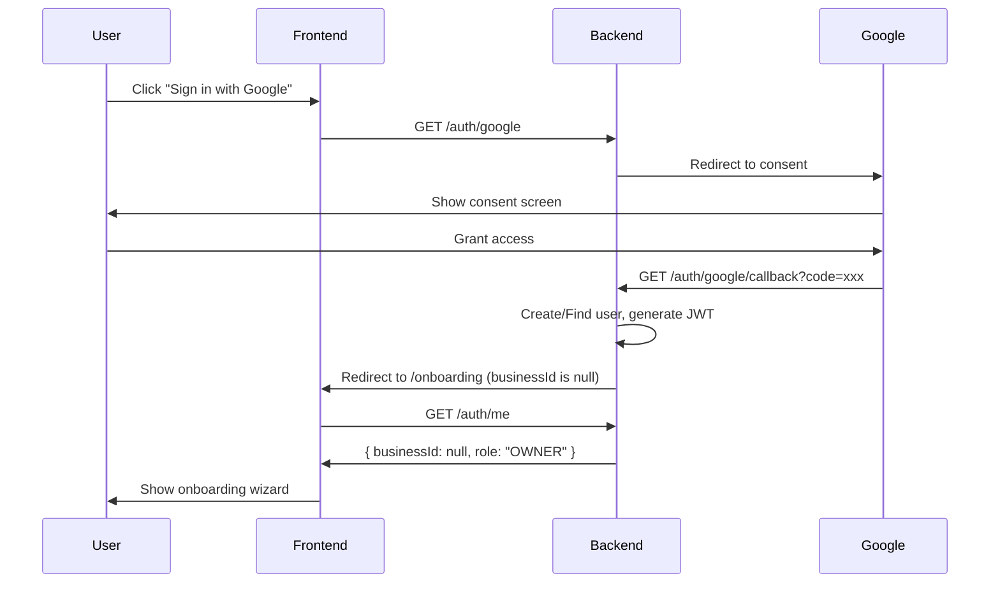
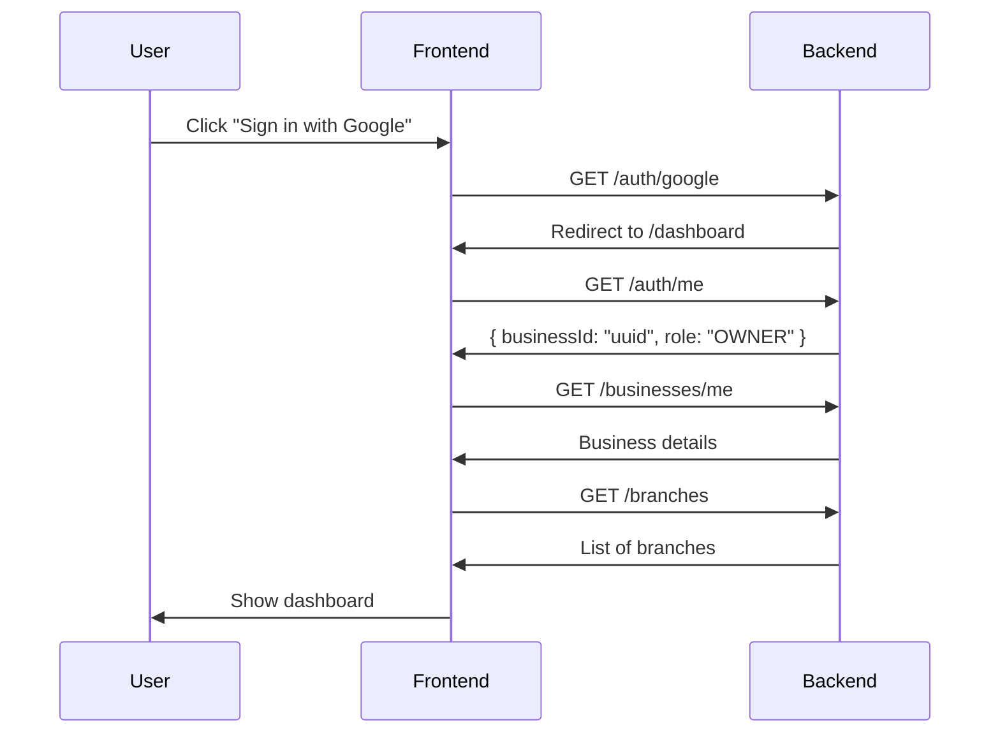
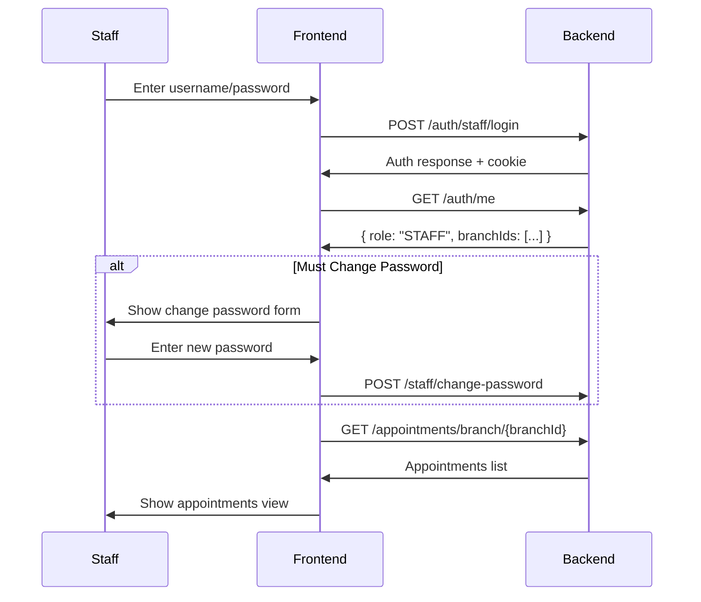
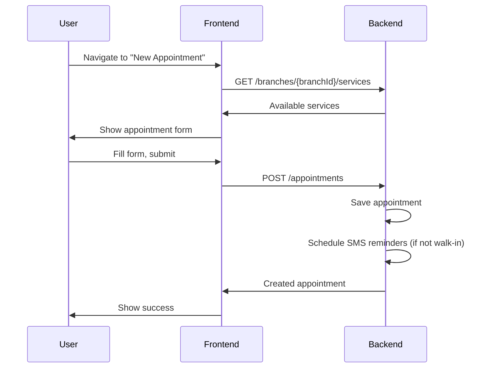

# Frontend Flows

Step-by-step user flows for frontend implementation.

---

## Flow 1: New Owner Onboarding

This flow handles first-time owners who sign in via Google OAuth.



### Implementation Steps

1. **Redirect to Google OAuth**

   ```javascript
   window.location.href = "/auth/google";
   ```

2. **Check auth status after redirect**

   ```javascript
   const response = await fetch("/auth/me", { credentials: "include" });
   const { data } = await response.json();

   if (data.role === "OWNER" && !data.businessId) {
     // Show onboarding wizard
     navigate("/onboarding");
   }
   ```

3. **Complete onboarding (create business + branch)**

   ```javascript
   const response = await fetch("/businesses", {
     method: "POST",
     credentials: "include",
     headers: { "Content-Type": "application/json" },
     body: JSON.stringify({
       name: "My Clinic",
       branch: {
         name: "Main Branch",
         address: "123 Main St",
         phoneNumber: "09123456789",
       },
     }),
   });

   // JWT is auto-refreshed with new businessId
   const { data } = await response.json();
   console.log(data.firstBranchId); // Use this for subsequent operations
   ```

4. **(Optional) Add services**

   ```javascript
   await fetch("/services", {
     method: "POST",
     credentials: "include",
     headers: { "Content-Type": "application/json" },
     body: JSON.stringify({
       name: "Haircut",
       description: "Basic haircut",
       basePrice: 150.0,
       durationMinutes: 30,
     }),
   });
   ```

5. **(Optional) Add staff**

   ```javascript
   await fetch("/staff", {
     method: "POST",
     credentials: "include",
     headers: { "Content-Type": "application/json" },
     body: JSON.stringify({
       username: "staff1",
       temporaryPassword: "temp123456",
       branchIds: [firstBranchId],
     }),
   });
   ```

6. **Redirect to dashboard**
   ```javascript
   navigate("/dashboard");
   ```

---

## Flow 2: Returning Owner Login

For owners who have already completed onboarding.



### Implementation Steps

1. **Load user and business data**
   ```javascript
   async function loadDashboardData() {
     const [userRes, businessRes, branchesRes] = await Promise.all([
       fetch("/auth/me", { credentials: "include" }),
       fetch("/businesses/me", { credentials: "include" }),
       fetch("/branches", { credentials: "include" }),
     ]);

     const user = (await userRes.json()).data;
     const business = (await businessRes.json()).data;
     const branches = (await branchesRes.json()).data;

     return { user, business, branches };
   }
   ```

---

## Flow 3: Staff Login

For staff members created by the business owner.



### Implementation Steps

1. **Login**

   ```javascript
   const response = await fetch("/auth/staff/login", {
     method: "POST",
     credentials: "include",
     headers: { "Content-Type": "application/json" },
     body: JSON.stringify({
       username: "staff1",
       password: "temp123456",
     }),
   });

   const { data } = await response.json();
   // data: { userId, role, businessId, branchIds }
   ```

2. **Check if password change required**

   ```javascript
   // This flag would need to be added to the auth response or checked separately
   // For now, assume first login requires password change
   if (isFirstLogin) {
     navigate("/change-password");
   }
   ```

3. **Change password (if required)**

   ```javascript
   await fetch("/staff/change-password", {
     method: "POST",
     credentials: "include",
     headers: { "Content-Type": "application/json" },
     body: JSON.stringify({
       currentPassword: "temp123456",
       newPassword: "newSecurePassword123",
     }),
   });
   ```

4. **Load appointments for assigned branches**

   ```javascript
   const { branchIds } = userData;

   // Load appointments for first branch (or let user select)
   const response = await fetch(`/appointments/branch/${branchIds[0]}`, {
     credentials: "include",
   });

   const appointments = (await response.json()).data;
   ```

---

## Flow 4: Creating an Appointment

For both owners and staff.



### Implementation Steps

1. **Load available services for the branch**

   ```javascript
   const servicesRes = await fetch(`/branches/${branchId}/services`, {
     credentials: "include",
   });
   const services = (await servicesRes.json()).data;
   ```

2. **Create appointment**

   ```javascript
   const response = await fetch("/appointments", {
     method: "POST",
     credentials: "include",
     headers: { "Content-Type": "application/json" },
     body: JSON.stringify({
       businessId: currentBusinessId,
       branchId: selectedBranchId,
       customerName: "John Doe",
       customerPhone: "09123456789",
       startDateTime: "2026-02-05T10:00:00+08:00",
       endDateTime: "2026-02-05T10:30:00+08:00",
       notes: "First time customer",
       isWalkin: false,
     }),
   });

   const appointment = (await response.json()).data;
   ```

3. **Handle walk-in appointments**
   ```javascript
   // Walk-ins don't get SMS reminders
   const walkInAppointment = {
     ...appointmentData,
     isWalkin: true,
   };
   ```

---

## Flow 5: Updating Appointment Status

Track appointment lifecycle.

### Status Transitions

```
SCHEDULED → CONFIRMED → COMPLETED
         ↘           ↘
          CANCELLED   NO_SHOW
```

### Implementation

```javascript
async function updateAppointmentStatus(appointmentId, newStatus) {
  // First get current appointment
  const getRes = await fetch(`/appointments/${appointmentId}`, {
    credentials: "include",
  });
  const current = (await getRes.json()).data;

  // Update with new status
  const response = await fetch(`/appointments/${appointmentId}`, {
    method: "PUT",
    credentials: "include",
    headers: { "Content-Type": "application/json" },
    body: JSON.stringify({
      customerName: current.customerName,
      customerPhone: current.customerPhone,
      startDateTime: current.startDateTime,
      endDateTime: current.endDateTime,
      notes: current.notes,
      status: newStatus, // 'CONFIRMED', 'COMPLETED', 'NO_SHOW', 'CANCELLED'
    }),
  });

  return (await response.json()).data;
}
```

---

## Flow 6: Managing Services

Business-level service catalog management.

### Create Service at Business Level

```javascript
// 1. Create the service template
const serviceRes = await fetch("/services", {
  method: "POST",
  credentials: "include",
  headers: { "Content-Type": "application/json" },
  body: JSON.stringify({
    name: "Premium Massage",
    description: "60-minute full body massage",
    basePrice: 800.0,
    durationMinutes: 60,
    availableGlobally: true,
  }),
});
const service = (await serviceRes.json()).data;
```

### Assign to Branch with Custom Pricing

```javascript
// 2. Assign to a specific branch (optional custom price)
await fetch(`/branches/${branchId}/services`, {
  method: "POST",
  credentials: "include",
  headers: { "Content-Type": "application/json" },
  body: JSON.stringify({
    serviceId: service.id,
    customPrice: 900.0, // Branch-specific price
    active: true,
  }),
});
```

---

## Flow 7: Configuring SMS Reminders

Set up automatic SMS reminders.

```javascript
// Create a reminder config (e.g., 24 hours before)
await fetch("/reminder-configs", {
  method: "POST",
  credentials: "include",
  headers: { "Content-Type": "application/json" },
  body: JSON.stringify({
    leadTimeHours: 24,
    messageTemplate:
      "Hi {customer_name}! Reminder: Your appointment at {branch_name} is tomorrow ({date}) at {time}. See you!",
    enabled: true,
  }),
});

// Create another (e.g., 2 hours before)
await fetch("/reminder-configs", {
  method: "POST",
  credentials: "include",
  headers: { "Content-Type": "application/json" },
  body: JSON.stringify({
    leadTimeHours: 2,
    messageTemplate:
      "Hi {customer_name}! Your appointment at {branch_name} is in 2 hours ({time}). See you soon!",
    enabled: true,
  }),
});
```

---

## Flow 8: Viewing SMS Logs

Monitor SMS delivery status.

```javascript
async function loadSmsLogs(page = 0, size = 20) {
  const response = await fetch(`/sms/logs?page=${page}&size=${size}`, {
    credentials: "include",
  });

  const { data } = await response.json();

  return {
    logs: data.content,
    totalPages: data.totalPages,
    currentPage: data.number,
  };
}

async function checkSmsBalance() {
  const response = await fetch("/sms/balance", {
    credentials: "include",
  });

  const { data } = await response.json();
  return data.remainingCredits;
}
```

---

## Role-Based UI Guidelines

### Owner View

- Full sidebar navigation
- Dashboard with analytics
- All branches visible
- Settings and configuration access
- Staff management
- SMS logs and balance

### Staff View

- Minimal UI (no sidebar)
- Appointments list only
- Only assigned branches visible
- Create and edit appointments
- No delete capability
- No settings access
